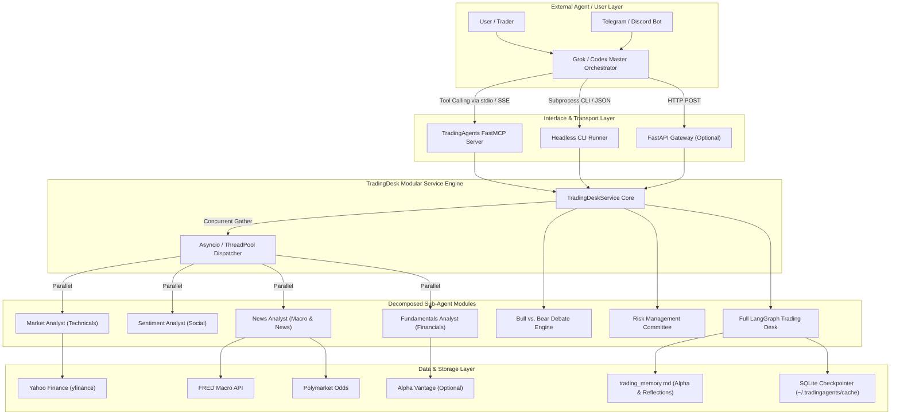

# Product Requirements & System Design Document (PRD / SDD)
## Project: TradingAgents Modular Orchestrator & MCP/API Gateway

**Version**: 1.0.0  
**Author**: Antigravity  
**Target Audience**: Autonomous Engineering Agents (Codex, Grok bot, LLM engineers)  
**Status**: Ready for Implementation  
**Base Repository**: `TauricResearch/TradingAgents` (v0.4.0)

---

## 1. Executive Summary & Problem Statement

### 1.1 Context
`TradingAgents` is a LangGraph-based multi-agent financial trading framework that simulates an institutional trading desk. It features 11 specialized agent roles:
- **Analyst Team**: Market (Technicals), Sentiment (Social), News (Macro/Events), Fundamentals (Financials)
- **Researcher Team**: Bull Researcher vs. Bear Researcher moderated by a Research Manager
- **Execution Team**: Trader Agent
- **Risk Management Team**: Aggressive, Conservative, and Neutral Debaters moderated by a Portfolio Manager
- **Memory & Reflection**: Persistent trade log (`trading_memory.md`) tracking real returns and alpha vs. market benchmarks (SPY, regional indices).

### 1.2 Current Bottlenecks
1. **Interactive-Only TUI**: The existing CLI (`cli/main.py`) relies on interactive terminal prompts (`questionary` / `rich`). External bots (Telegram/Discord bots, Codex, Grok bot) cannot invoke it non-interactively.
2. **Strict Sequential Execution**: The 4 analysts are wired sequentially in LangGraph (`setup.py`), resulting in high latency (3–5 minutes) and 15–20 LLM calls per query, even when the user only needs a simple technical check or macro summary.
3. **No External Protocol (MCP/REST)**: External AI agents cannot call TradingAgents as a native tool, function, or service.

### 1.3 Objective
Decompose TradingAgents into a **modular, parallelized service layer** exposed via:
1. **Model Context Protocol (MCP)** for native agent integration (Claude, Cursor, Codex, Grok MCP clients).
2. **Headless CLI** (`--ticker`, `--date`, `--mode`, `--json`) for shell/subprocess automation.
3. **Python SDK / REST Service** for direct programmatic embedding and webhooks.

This allows a **Master Orchestrator (e.g. Grok)** to intelligently triage user requests, dispatch only the necessary specialist sub-agents, run data gathering in parallel, and synthesize high-level financial intelligence.

---

## 2. System Architecture



---

## 3. Functional Requirements & Tool Catalog

The service layer must expose tools across **5 capability tiers**, allowing the orchestrator to pick the lowest-latency, lowest-cost tool that satisfies the user's intent.

### Tier 1: Deterministic Data Tools (Zero LLM Tokens, < 2s Latency)
These tools fetch hard financial data without invoking an LLM.

| Tool Name | Parameters | Output Schema | Description |
| :--- | :--- | :--- | :--- |
| `get_market_snapshot` | `ticker: str` | `{ ohlcv, current_price, volume, 52w_high, 52w_low, change_pct }` | Ground-truth market data snapshot via yfinance. |
| `get_technical_indicators` | `ticker: str`, `indicators: list[str]` | `{ indicator: value, ... }` | Exact mathematical indicators (RSI, MACD, 50/200 SMA, Bollinger, ATR). |
| `get_macro_indicators` | None | `{ fed_funds_rate, cpi_inflation, gdp_growth, 10y_treasury, unemployment }` | Key US macroeconomic indicators from FRED. |
| `get_prediction_markets` | `query: str` | `[ { question, probability, volume, outcome } ]` | Prediction market odds from Polymarket. |
| `get_insider_activity` | `ticker: str` | `[ { date, insider_name, relation, transaction_type, shares, value } ]` | SEC Form 4 insider trading transactions. |
| `get_financial_statements` | `ticker: str`, `statement: "balance" \| "income" \| "cashflow"` | `{ fiscal_year: { metric: value } }` | Audited financial statement metrics. |

### Tier 2: Specialist Analyst Agents (Targeted LLM Reasoning, 10–20s Latency)
These run a single domain specialist agent.

| Tool Name | Parameters | Output Schema | Description |
| :--- | :--- | :--- | :--- |
| `analyze_technicals` | `ticker: str`, `trade_date: str?` | `{ technical_report: str, key_levels: dict }` | Evaluates support/resistance, trend strength, and momentum signals. |
| `analyze_sentiment` | `ticker: str`, `trade_date: str?` | `{ sentiment_report: str, crowd_bias: str }` | Analyzes StockTwits, Reddit, and retail crowd positioning. |
| `analyze_news_macro` | `ticker: str`, `trade_date: str?` | `{ news_report: str, macro_headwinds: list }` | Synthesizes geopolitical events, central bank shifts, and company news. |
| `analyze_fundamentals` | `ticker: str`, `trade_date: str?` | `{ fundamentals_report: str, valuation_summary: str }` | Evaluates balance sheet strength, margins, debt ratios, and moat. |

### Tier 3: Parallel Multi-Analyst Suite (Concurrent Execution, 15–25s Latency)
Runs multiple selected analysts **concurrently** rather than sequentially.

| Tool Name | Parameters | Output Schema | Description |
| :--- | :--- | :--- | :--- |
| `analyze_ticker_parallel` | `ticker: str`, `analysts: list[str]`, `trade_date: str?` | `{ market?: str, sentiment?: str, news?: str, fundamentals?: str }` | Concurrent dispatch of selected analysts via `asyncio.gather`. |

### Tier 4: Committee Debates & Full Trading Desk (Comprehensive, 60–120s Latency)
For high-conviction decision making before capital allocation.

| Tool Name | Parameters | Output Schema | Description |
| :--- | :--- | :--- | :--- |
| `run_bull_bear_debate` | `ticker: str`, `analyst_reports: dict?` | `{ bull_case: str, bear_case: str, consensus_plan: str }` | Multi-round debate between Bull and Bear researchers. |
| `evaluate_portfolio_risk` | `ticker: str`, `proposed_trade: dict` | `{ aggressive_review: str, conservative_review: str, risk_verdict: str }` | Risk committee debate and sizing constraints. |
| `run_full_trade_desk` | `ticker: str`, `trade_date: str?`, `asset_type: "stock" \| "crypto"` | `{ signal: "BUY"\|"HOLD"\|"SELL"..., price_target: float, stop_loss: float, thesis: str, complete_report_path: str }` | Executes complete 11-agent desk and logs to memory. |

### Tier 5: Memory, Alpha & Self-Reflection
| Tool Name | Parameters | Output Schema | Description |
| :--- | :--- | :--- | :--- |
| `get_ticker_memory` | `ticker: str` | `{ past_decisions: list, realized_alpha_vs_spy: float, lessons_learned: list }` | Retrieves historical track record and reflections for ticker. |
| `log_trade_outcome` | `ticker: str`, `trade_date: str`, `realized_return: float` | `{ status: "success", reflection: str }` | Records real trade performance and triggers post-trade reflection. |

---

## 4. Technical Specifications & Implementation Design

### 4.1 Service Core (`tradingagents/service/desk_service.py`)
A decoupled Python service that wraps `TradingAgentsGraph` and the raw data tools.

```python
import asyncio
from concurrent.futures import ThreadPoolExecutor
from datetime import datetime
from typing import Any
from tradingagents.default_config import DEFAULT_CONFIG
from tradingagents.graph.trading_graph import TradingAgentsGraph
from tradingagents.agents.utils.agent_utils import (
    get_verified_market_snapshot,
    get_indicators,
    get_macro_indicators,
    get_prediction_markets,
    get_insider_transactions,
    get_fundamentals,
)

class TradingDeskService:
    def __init__(self, config_overrides: dict[str, Any] | None = None):
        self.config = DEFAULT_CONFIG.copy()
        if config_overrides:
            self.config.update(config_overrides)
        self._executor = ThreadPoolExecutor(max_workers=8)

    def get_market_data(self, ticker: str, date: str) -> dict:
        return get_verified_market_snapshot.invoke({"ticker": ticker, "date": date})

    def run_analyst(self, ticker: str, analyst_key: str, date: str) -> str:
        """Executes a single analyst node in isolation."""
        sub_graph = TradingAgentsGraph(selected_analysts=[analyst_key], config=self.config)
        state, _ = sub_graph.propagate(company_name=ticker, trade_date=date)
        return state.get(f"{analyst_key}_report", "")

    async def run_analysts_concurrent(self, ticker: str, analyst_keys: list[str], date: str) -> dict[str, str]:
        """Dispatches multiple analysts in parallel using ThreadPoolExecutor."""
        loop = asyncio.get_running_loop()
        tasks = [
            loop.run_in_executor(self._executor, self.run_analyst, ticker, key, date)
            for key in analyst_keys
        ]
        results = await asyncio.gather(*tasks)
        return dict(zip(analyst_keys, results))

    def run_full_pipeline(self, ticker: str, date: str, asset_type: str = "stock") -> dict:
        """Runs the entire 11-agent institutional pipeline."""
        graph = TradingAgentsGraph(config=self.config)
        final_state, signal = graph.propagate(company_name=ticker, trade_date=date, asset_type=asset_type)
        return {
            "signal": signal,
            "decision": final_state.get("final_trade_decision"),
            "trade_plan": final_state.get("trader_investment_plan"),
            "reports": {
                "market": final_state.get("market_report"),
                "sentiment": final_state.get("sentiment_report"),
                "news": final_state.get("news_report"),
                "fundamentals": final_state.get("fundamentals_report"),
            }
        }
```

### 4.2 Headless CLI (`cli/headless.py`)
Provides non-interactive automation for cron jobs, CI pipelines, and bash sub-agents.

```bash
# Full institutional desk
python -m cli.headless --ticker NVDA --mode full --json

# Targeted technicals only
python -m cli.headless --ticker TSLA --mode technical --json

# Parallel dual-analyst scan
python -m cli.headless --ticker BTC-USD --analysts market,sentiment --json
```

**CLI Arguments**:
- `--ticker`: Instrument symbol (e.g. `AAPL`, `NVDA`, `BTC-USD`, `0700.HK`). Required.
- `--date`: Date in `YYYY-MM-DD` (defaults to current date).
- `--mode`: `full` | `technical` | `sentiment` | `news` | `fundamentals` | `macro` | `data`.
- `--analysts`: Comma-separated list for custom parallel subsets (`market,news`).
- `--json`: Output raw structured JSON to `stdout` for programmatic ingestion.
- `--save-dir`: Override destination for reports (default: `~/.tradingagents/logs/`).

### 4.3 Model Context Protocol (MCP) Server (`mcp_server/trading_mcp.py`)
Built using the official `mcp` library, exposing stdio and SSE endpoints:

```python
from mcp.server.fastmcp import FastMCP
from tradingagents.service.desk_service import TradingDeskService

mcp = FastMCP("TradingAgents-Desk")
service = TradingDeskService()

@mcp.tool()
def get_market_data(ticker: str, date: str | None = None) -> dict:
    """Fetch exact OHLCV prices, volume, and range for a ticker."""
    return service.get_market_data(ticker, date or service.today())

@mcp.tool()
async def analyze_ticker(ticker: str, aspects: list[str] = ["market", "news"], date: str | None = None) -> dict:
    """Run specified analyst agents in parallel (options: 'market', 'news', 'sentiment', 'fundamentals')."""
    return await service.run_analysts_concurrent(ticker, aspects, date or service.today())

@mcp.tool()
def execute_full_trade_desk(ticker: str, date: str | None = None) -> dict:
    """Run full 11-agent trading desk (analysts, bull/bear debate, trader, risk committee, portfolio manager)."""
    return service.run_full_pipeline(ticker, date or service.today())

@mcp.tool()
def get_macro_environment() -> dict:
    """Get Federal Reserve interest rates, inflation, GDP, and prediction market event probabilities."""
    return service.get_macro_overview()
```

---

## 5. Grok Master Orchestrator System Prompt & Intent Routing

When connecting Grok as the root orchestrator, provide the following routing policy in its system instructions:

```markdown
You are the Chief Investment Officer (CIO) and Master Orchestrator of a quantitative trading desk.
You have access to the TradingAgents tool suite.

Follow this triage protocol:
1. Pure price, quote, or metric questions ("What is NVDA's RSI?", "What is BTC's 200 SMA?"):
   → Call `get_technical_indicators` or `get_market_snapshot`. Never run a full desk for raw facts.
2. Single-domain questions ("What is the sentiment on TSLA?", "How do AAPL financials look?"):
   → Call the matching specialist: `analyze_technicals`, `analyze_sentiment`, or `analyze_fundamentals`.
3. Sector or Macro questions ("How does the tech sector look?", "Will the Fed raise rates?"):
   → Call `get_macro_environment` and dispatch `analyze_ticker(aspects=['news'])` across the key sector tickers in parallel.
4. Capital commitment or Buy/Sell decisions ("Should I buy NVDA?", "Give me a trade plan for ETH"):
   → Invoke `execute_full_trade_desk`. Synthesize the Portfolio Manager's 5-tier rating, price target, stop-loss, and risk committee debate into your final response.
```

---

## 6. Verification & Acceptance Criteria

| ID | Test Scenario | Acceptance Criteria |
| :--- | :--- | :--- |
| **AC-01** | Non-interactive CLI Execution | `python -m cli.headless --ticker AAPL --mode technical --json` returns valid JSON to stdout without user prompts. |
| **AC-02** | Parallel Analyst Concurrency | Running 3 analysts via `run_analysts_concurrent` completes in < 35 seconds (vs. > 90s sequentially). |
| **AC-03** | MCP Server Handshake | `fastmcp` server initializes on stdio, responds to `tools/list`, and successfully executes `get_market_data`. |
| **AC-04** | Error Isolation | A network failure on an optional data source (e.g. FRED) fails open with a warning, not crashing the primary analysis. |
| **AC-05** | Memory & Reflection Fidelity | Completed full runs append decision records to `~/.tradingagents/memory/trading_memory.md` with benchmark alpha tracking. |

---

## 7. Next Steps & Implementation Roadmap

1. **Step 1**: Implement `tradingagents/service/desk_service.py` to decouple graph execution and enable `asyncio` parallel dispatch.
2. **Step 2**: Implement `cli/headless.py` with `typer` / `argparse` for non-interactive scripting.
3. **Step 3**: Implement `mcp_server/trading_mcp.py` using `mcp` / `fastmcp`.
4. **Step 4**: Test end-to-end tool execution with external agent caller (Grok / Codex).
